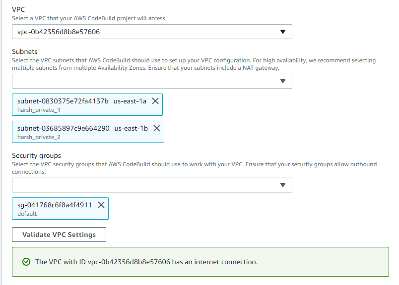

# Deployment over AWS Cloud
## _Understanding the workflow_

**Networking :**

We create a VPC (Virtual Private Cloud) in the desired AWS region.
All the other resources will be created under that network.
Under VPC we usually create:
- 6 subnets – 2 private, 2 public, and other 2 private subnets for the database
- 3 route tables for the 3 pairs of subnets
- 1 internet gateway for the public subnets
- 1 NAT gateway for the private subnets.
```sh
Amazon Virtual Private Cloud (Amazon VPC) enables you to launch AWS resources into a virtual network that you have defined. This virtual network closely resembles a traditional network that you would operate in your own data center, with the benefits of using the scalable infrastructure of AWS.
```

**Database :**

For database we use Amazon RDS (Relational Database Service) service.
```sh
Amazon Relational Database Service (Amazon RDS) is a web service that makes it easier to set up, operate, and scale a relational database in the AWS Cloud. It provides cost-efficient, resizable capacity for an industry-standard relational database and manages common database administration tasks.
```

We also setup Amazon Elasticache Service for Redis or Memcached for caching which accelerates the application and database performance.
```sh
Amazon ElastiCache makes it easy to set up, manage, and scale distributed in-memory cache environments in the AWS Cloud. It provides a high performance, resizable, and cost-effective in-memory cache, while removing complexity associated with deploying and managing a distributed cache environment. ElastiCache works with both the Redis and Memcached engines.
``` 

**Backend :**

We containerize the application using Amazon ECS and ECR (Elastic Container Registry) Service.
We first set a webhook on gitlab of  an API Gateway and a Lambda Function in order to fetch the code and pull the docker image in ECR repository.
```sh
Amazon Elastic Container Registry (ECR) is a fully managed container registry that makes it easy to store, manage, share, and deploy your container images and artifacts anywhere.
```

Then we use Amazon ECS (Elastic Container Service) for creating clusters, task definitions and services using the fetched docker image from ECR.
Under ECS we use different deployment types like rolling update and blue/green deployment for different services.
```sh
•	Amazon Elastic Container Service (Amazon ECS) is a highly scalable, fast, container management service that makes it easy to run, stop, and manage Docker containers on a cluster of Amazon EC2 instances.

•	When the rolling update (ECS) deployment type is used for your service, when a new service deployment is started the Amazon ECS service scheduler replaces the currently running tasks with new tasks. The number of tasks that Amazon ECS adds or removes from the service during a rolling update is controlled by the deployment configuration. 
The deployment configuration consists of the minimumHealthyPercent 
and maximumPercent values which are defined when the service is created, but can also be updated on an existing service.

•	The blue/green deployment strategy creates two independent infrastructure environments. The blue environment contains the previous code or configuration, while the green environment contains the newest code or configurations. Traffic is then shifted to the newest environment (green) and diverted away from the previous environment (blue) by redirecting the DNS record to green load balancer using Route 53.
Since both environments have their own networks, the blue/green strategy has the benefit of being able to quickly and seamlessly roll back a deployment if failure is encountered. A downside of implementing blue/green is the uptick in cost due to running two infrastructure environments simultaneously.
```

Other services like Amazon S3 (Scalable Storage Service) Buckets and EC2 (Elastic Compute Cloud) Instances are also created depending on the need.
```sh
•	Amazon S3 is an object storage service that offers industry-leading scalability, data availability, security, and performance.

•	Amazon Elastic Compute Cloud (Amazon EC2) provides scalable computing capacity in the Amazon Web Services (AWS) Cloud. Using Amazon EC2 eliminates your need to invest in hardware up front, so you can develop and deploy applications faster. You can use Amazon EC2 to launch as many or as few virtual servers as you need, configure security and networking, and manage storage. Amazon EC2 enables you to scale up or down to handle changes in requirements or spikes in popularity, reducing your need to forecast traffic.
```

We then create Load Balancer generally the Application Load Balancer which distributes the incoming application traffic. With the load balancer we need target groups and security groups for all the other services that we create like the ECS services, the RDS instance etc.
```sh
Elastic Load Balancing automatically distributes your incoming traffic across multiple targets, such as EC2 instances, containers, and IP addresses, in one or more Availability Zones. It monitors the health of its registered targets, and routes traffic only to the healthy targets. Elastic Load Balancing scales your load balancer as your incoming traffic changes over time. It can automatically scale to the vast majority of workloads.
```

We also use Amazon Cloudformation Service to automate the creation of some of the resources mentioned above using yaml or json scripts.
```sh
AWS CloudFormation is a service that helps you model and set up your AWS resources so that you can spend less time managing those resources and more time focusing on your applications that run in AWS. You create a template that describes all the AWS resources that you want (like Amazon EC2 instances or Amazon RDS DB instances), and CloudFormation takes care of provisioning and configuring those resources for you. You do not need to individually create and configure AWS resources and figure out what's dependent on what; CloudFormation handles that.
```

At the end we setup a Pipeline using the AWS Codepipeline service for maintaining CI/CD i.e continuous integration and continuous deployment for the projects.
```sh
AWS CodePipeline is a continuous integration and continuous delivery service for fast and reliable application and infrastructure updates. CodePipeline builds, tests, and deploys your code every time there is a code change, based on the release process models you define.
```

**Frontend :**

AWS Amplify Hosting provides a git-based workflow for hosting full-stack serverless web apps with continuous deployment. We connect the github or gitlab repository and branch to AWS Amplify.
```sh
AWS Amplify is a set of products and tools that enable mobile and front-end web developers to build and deploy secure, scalable full-stack applications, powered by AWS.
```


## _Creating ECS Setup_

**1- Create an empty cluster**
From the AWS console, click on the **'Services'** tab and click on **'Elastic Container Service'**. From the ECS page click on **'Clusters'** in the left-hand pane. Now, click on **'Create cluster'**. Select the **“EC2 Linux + Networking”** option and on the next page give your cluster a name. Tick the **'Create an empty cluster'** and click on **'Create'**.


**2- Create an ECR repository**
To create an ECR repo go to the ECS console and select **'Repositories'** from the left-hand pane. Click on **'Create repository'**. Give the repository a name. Enable the **“Scan on push”** option and click on the **'Create repository'** button.


**3- Create an application load balancer**
From the EC2 console, click on **'Load Balancers'** from the left-hand pane.  Then click on **'Create load balancer'** and select **“Application Load Balancer”**. Give the load balancer a suitable name, select all the availability zones for your VPC and click **'Next'**. Skip to the **'Configure security groups'** stage and opt to create a new security group. Under **'Type'** select **"HTTP"** and **"Anywhere"** as the **'Source'**.
Click “Next” and Create a new target group. Give the target group a name and make sure the protocol and port are set to “HTTP” and “80” respectively. Change the target type to “IP”. Under “Health checks” select the “HTTP” protocol again and for “path” select the path of your web app where you want your health checks to be done.


**4- Create a task definition**
Go to the ECS console and click on **'Task Definitions'**. Select **'Create task definition'** and select **'EC2'** compatibility option. Give your task definition a name. Select **"none"** for the IAM role and **“awsvpc”** for the network mode. Under task size set **'Task memory'** as **"2048"** and **'CPU'** as **"1024"**. Scroll down and click on **'Add container'**.
 


Give the container a name and paste the image URI . For **'Port mappings'** add the container ports you want to use. The only one I’m using is port 80 of my container. Click on “Add” and you will be taken back to the task creation page. You should now see your container entry listed as part of the task definition. Then Click on **'Create'**.


**5- Create an ECS service**
Creating an ECS service. Go to the empty cluster you created earlier and under **'Services'** click on **'Create'**. Select the **'EC2'** launch type, give your service a name and put in **"1"** for the number of tasks. Click on **'Next'**. Select your cluster VPC and all the subnets available. Under **'Load balancing'** select **“Application Load Balancer”**, then select the load balancer you just created. Now, select your container port and click on **'Add to load balancer'**. Select the listener port we created with the load balancer i.e **“80:HTTP”** and change the path pattern to the default path for your web app click on **'Create service'**.


You’ll also see targets being registered inside the target group you just created on the EC2 console. You can monitor the health checks under the **'Targets'** section on your target group page.

### Create Code Pipeline

Code Pipeline will have 3 stages Source, Build and Deploy.
Go to AWS Code Pipeline page and Click on Create Pipeline.
1.	Enter Pipeline Name and Leave Default for Service Role and click Next


2. Select AWS Code Commit as a source provider. Select your Code Commit Repository and Branch Name. Go to Add Build Stage.


3. In build Provider select AWS CodeBuild. We need to have a CodeBuild Project for CodePipeline which will create Docker Image and push it to our ECR Repository. Click on Create Project under Project Name a new window will pop-up. Write project name and enter Configuration as shown below.

    

    Make sure you check the **Privileged** check box. This will allow code build to build Docker images. 
    
    
    
    Scroll down to build Spec and add build spec file name. My file name is “buildspec.yaml”
    
    
 
    Leave everything as default and click on Continue to Code Pipeline. Your Code Build project name appears in Project Name section. Go to Add Deploy Stage.


4. Select Amazon ECS as a Deploy Provider. Select your ECS Cluster Name and Service Name. Type “imagedefinitions.json” in Image definition file field. This file is artifact (output) from our code build which includes information about our ECR Image location and our container name in task definition.
Make sure you write same file name inside Image definition file field as you have written in buildspec.yaml file in artifacts block.


Review your Code Pipeline and click **Create Pipeline**.


